### 成果推荐及讨论

- ##### [Mahmoud Afifi](https://twitter.com/mahmoudnafifi/status/1424180438101368835)
  Excited to announce that our paper on cross-camera color constancy has been accepted as an oral presentation at #ICCV2021
  
  
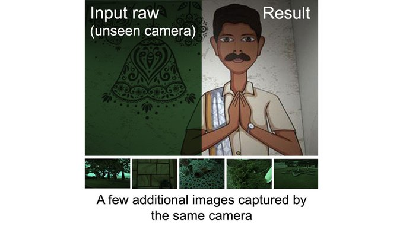

  
  abs: https://arxiv.org/pdf/2011.11890.pdf code: https://github.com/mahmoudnafifi/C5
  
  Main idea: With some extra (unlabeled) test-set images, you can build a hyper-network that calibrates itself at test time to previously unseen cameras.
  
  
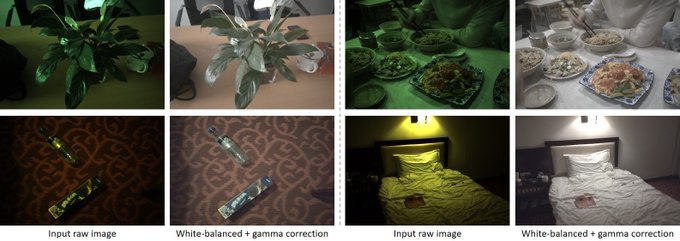

- ##### [Andrej Karpathy](https://twitter.com/karpathy/status/1424469506403934210)
  Perceiver IO is good reading/pointers for neural net architectures https://arxiv.org/abs/2107.14795 esp w.r.t. encoding/decoding schemes of various modalities to normalize them to & from Transformer-amenable latent space (a not-too-large set of vectors), where the bulk of compute happens.
  
  
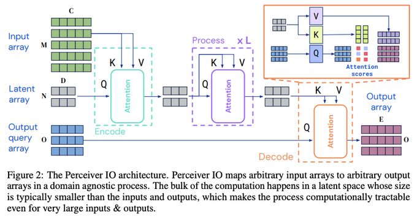

  
  Neural nets design space today is v large and heterogeneous - a "free for all". May be that just-general-enough architecture spaces like this become the happy medium that unifies them into a common language, with a library of encoders/decoders, a fixed set of hyperparameters, etc. This would then allow for more "plug and play" strong baselines in many problems, potentially with visual drag and drop design tools, tractable automated architecture/hyper-parameter search, etc. I miss a nonlinear step for manipulating V in place every time V seems to be equal to K.
  
  - **Drezil @kif.rocks:** And it feels to me like that is is indeed general, but not small enough in many cases (meaning there is a way smaller architecture with the same performance).

- ##### [Chaitanya K. Joshi](https://twitter.com/chaitjo/status/1425389897423069188)
  Hi GNN friends, I'm creating an awesome-list on efficient Graph Neural Networks and scalable Graph Representation Learning. I'm excited about real-world applications of GNNs, and am looking to learn more about deploying them! Please help improve: https://github.com/chaitjo/awesome-efficient-gnn
  
  - **Chaitanya K. Joshi:** I do aim to keep it as 'on topic' as possible -- I want to compile must-read papers on **fundamental methodologies** for developing **efficient** and **scalable** GNN models.
  
  - **Chaitanya K. Joshi:** I am thinking of creating a new list on the intersection of GNNs and combinatorial optimization, which is another area I've been looking at recently. (But I do wonder if that line of research is already being deployed in real-world systems?)
  

- ##### [Forrester Cole](https://twitter.com/forrestercole/status/1425837764545757186)
  We have a new paper on differentiable rendering! The core idea is to produce differentiable occlusions by using non-diff. rasterization to point-sample the geometry, then differentiable splatting to draw the points to the screen. abs: https://arxiv.org/abs/2108.04886
  
  This approach uses autodiff for all derivatives, so it's simple to implement and needs no custom CUDA code. Even with autodiff, it renders complex geometry as fast or faster than any other diff. rasterizer and easily handles millions of faces.
  
  
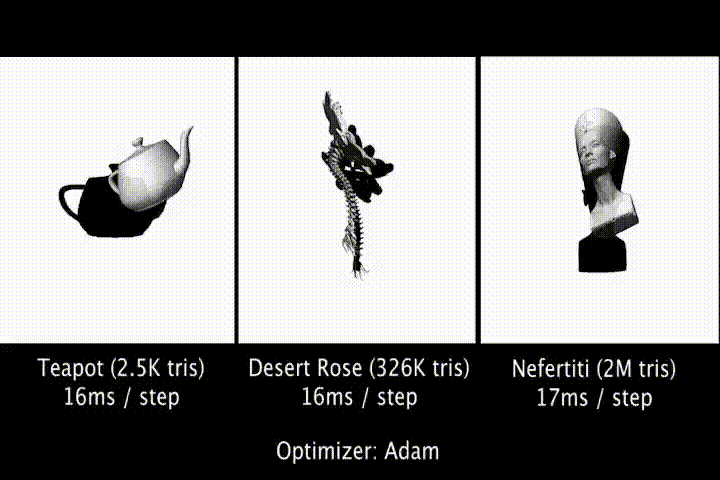

  
  But the real payoff is that it can handle any kind of surface you can rasterize, without needing to push derivatives through the rasterization step. So we can optimize B-Spline surfaces without worrying about differentiating through tessellation.And extract implicit surfaces using Marching Cubes without worrying about derivatives, allowing us to optimize SDF surfaces with weird topology, like Metaballs.
  
  

  
  Finally, we can render (and optimize!) everyone's favorite implicit surface representation, NeRF, by rendering an isosurface instead of ray marching. Surface-based rendering reduces the number of samples needed per ray to 1, down from 128 or more.
  
  The mesh-based version is implemented in TensorFlow Graphics and you can try it out right now in this Colab: https://colab.research.google.com/drive/1B9naJqk6_HFthOLhMSFuoE6tYYijZf2-?usp=sharing. A JAX version supporting implicit surface rasterization is coming soon.

- ##### [Russell Dinnage](https://twitter.com/ecologician/status/1427630304223760385)
  Progress! Got basic functionality working on #rbff! Here is a face flattened by boundary first flattening in R. Still have more functionality to add, and a lot of polishing, but we are in business! #rcpp #rstats (yes, it is kind of creepy looking).
  
  
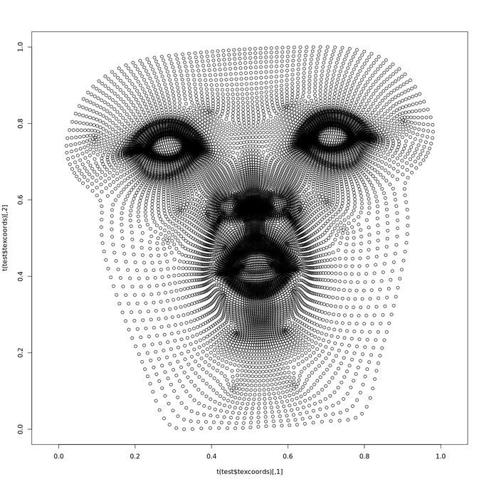

  
  This is the original face visualised using rgl. Face mesh was taken from the boundary first flattening repo (https://github.com/GeometryCollective/boundary-first-flattening)
  
  
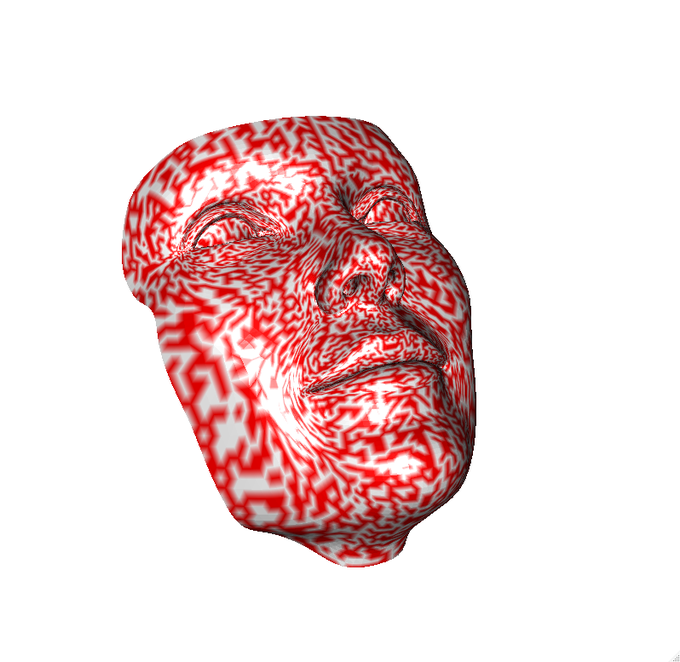

  
  Now you can flatten to a target boundary shape (in this case a simple square, I know, not very interesting, I will try something cooler soon). #rbff, and #rcpp #rstats package wrapping.
  
  - **Keenan Crane:** Nice progress on a port of Boundary First Flattening (#BFF) to the R programming language. (Original method here: http://geometry.cs.cmu.edu/bff)

- ##### [Tomasz Malisiewicz](https://twitter.com/quantombone/status/1427816337326362625)
  Reassessing the Limitations of CNN Methods for Camera Pose Regression
  
  abs: https://arxiv.org/abs/2108.07260
  
  A closer look into why directly regressing camera poses using ConvNets has not worked too well and a potential solution. #computervision #robotics #3D
  
  
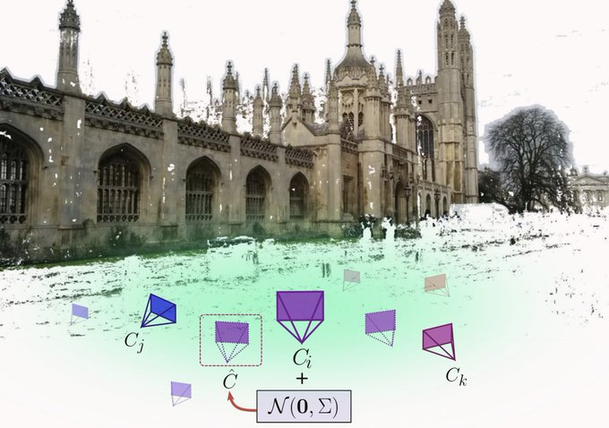

  
- ##### [Brian](https://twitter.com/bhsavery/status/1427732705806929923)
  Implemented @Peter_shirley's "Ray Tracing in One Weekend" in pure #python that can execute on the GPU (via Metal, Vulkan, CUDA) using a package called "Taichi". github: https://github.com/bsavery/ray-tracing-one-weekend-taichi. Was surprisingly easy and runs fast, these higher level languages for GPU could be the future!
  
  - **erithacus:** I'm planning on having a go at it in swift at some point. Will be a big challenge for me (especially as I’ll have to learn a bit of C++ to interpret the course), but I think it will be fun.
  
- ##### [EveryPoint](https://twitter.com/EveryPointIO/status/1427693517686513666)
  We are exploring the fusion of drone and iPhone capture with EveryPoint. The drone captures the general landscape and the rooftop structures. The EveryPoint app captures the building facades and hard to see areas. Next step, autonomous captures. #architecture #drones #3DModeling
  
  - **Jared Heinly:** Being able to combine aerial imagery with ground-based captures to create a unified 3D reconstruction is a powerful tool. Aerial imagery lacks data in hard-to-reach areas, and ground-based imagery lacks overall scene context. The combination gives you the best of both worlds.

  - **Jonathan Stephens:** Not everyone has the skills to model full buildings using drones, nor do they have access to emerging technology like Skydio's 3D Scan. We st @EveryPointIO are looking at hybrid capture method using automated drone capture with iPhone scans.
  

- ##### [Tomasz Malisiewicz](https://twitter.com/quantombone/status/1428185462611619845)
  Pixel-Perfect Structure-from-Motion with Featuremetric Refinement
  
  abs: https://arxiv.org/abs/2108.08291 code: https://github.com/cvg/pixel-perfect-sfm
  
  Cool new #computervision paper from ETHZ showing how to improve over classical detect-once-and-never-refine local features. Also now a part of the popular colmap #SfM library. #iccv2021
  
  
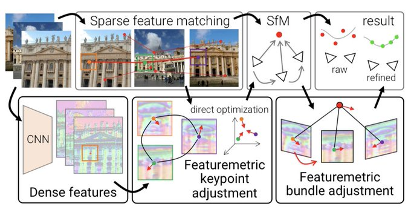

  
- ##### [Alan Wolfe](https://twitter.com/Atrix256/status/1428027321785536522)
  FLIP is an algorithm from NVIDIA that quantifies perceptual image quality. There's a real easy to compile and use C++ implementation on github. I just downloaded the source, compiled in VS and ran it! It has a cuda project too which runs a lot faster. code: https://github.com/NVlabs/flip
  
  - **Alan Wolfe:** It also has an option to let you spit data out to a CSV, so you can use this as part of automated testing or analysis.

  - **Wojciech Jarosz:** I was aware of FLIP, but just today I decided to give it a try since I’d like to create automated rendering tests against a reference solution for my class. I’m just struggling with how to get CMake to add FLIP not as a dependent library, but as an additional executable to build. I’ve started using the CPM cmake package manager, which makes adding libraries remarkably easy (much simpler than adding a bunch of git submodules). Not sure how to get it or native CMake to add a dependency that creates an executable, not a library. Was hoping to automate the tests using @github actions, but first need to get my CMake project to build FLIP as a subproject. As a fallback I have a home grown simple mean absolute difference image comparison tool, but would prefer something like FLIP to deal with noise.

  - **Mauricio:** Can this be used to measure variance in path-traced images, e.g. help decide when to stop sampling?
    - **Alan Wolfe:** I think the answer is yes, right? Only problem is you probably wouldn't want to run it after every spp, but have some schedule like every 10k maybe?
  
  - **LCTR:** Just wondered if a variation of that might be used to perhaps look for edits in photos / video footage? E.g. Lack of noise, non-matching noise, etc.
    - **Alan Wolfe:** Yeah, I'm betting it definitely could.  I was sort of thinking this could be good for automated testing in games, to make sure things reasonably match some "gold master" reference images?

- ##### [Michael Black](https://twitter.com/Michael_J_Black/status/1428050867245232147)
  Most mocap datasets don't include 3D objects, which makes learning about human-object interaction hard. This new dataset uses our 54-camera Vicon system and our MoSh technology to capture realistic bodies interacting with 3D scene objects. Nice work @M_E_Hassan and capture team! project page: https://samp.is.tue.mpg.de/
  
  
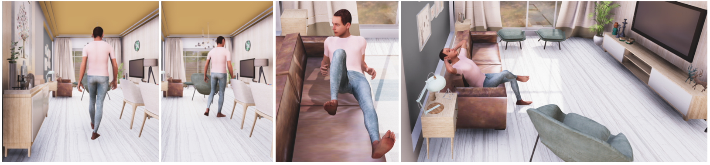

  

- ##### [Facebook AI](https://twitter.com/facebookai/status/1428839288913936387)
  What if you could create virtual boxing athletes that could automatically develop a winning strategy? We released a #deeplearning framework at #SIGGRAPH2021 that generates control policies for two-player sports where the players are simulated. Learn more: http://ow.ly/QSQt50FVee7
  
  - **Mark Montgomery:** Are they aware of the jack-in-the-box ready to spring from underneath, or sniper in the rafters? It's the unknown unknowns in the real world that really challenges AI systems. The controlled environments are more relevant to FB than most others.

- ##### [Maithra Raghu](https://twitter.com/maithra_raghu/status/1428740724074291208)
  
  Do Vision Transformers See Like Convolutional Neural Networks? New paper https://arxiv.org/abs/2108.08810. The successes of Transformers in computer vision prompts a fundamental question: how are they solving these tasks? Do Transformers act like CNNs, or learn very different features?  We explore this question in our paper, finding key differences between internal representations of the architectures, crucial roles played by attention and residual connections, and ramifications for localization and transfer learning.
  
  
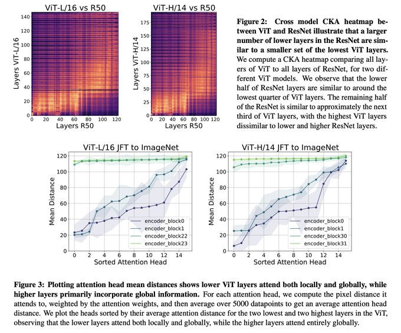

  
  Using representational similarity measures, we investigate the internal structure of the two architectures, finding striking differences, with ViT to having a much more uniform representation across all layers.
  
  
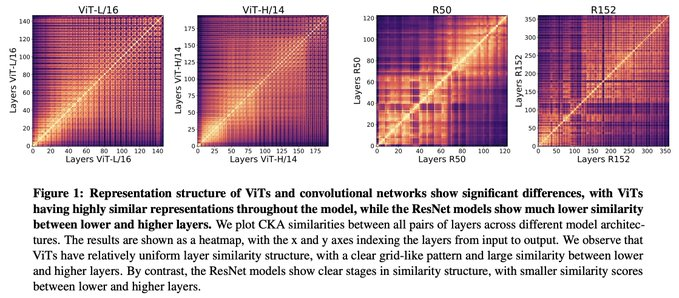

  
  An analysis of self-attention reveals some reasons for this difference: very early ViT layers learn to incorporate local and *global* spatial information, unlike CNN early layers with their smaller receptive field size. But attending locally is also very important! It is automatically encoded in CNNs, but larger ViTs only learn to do this with enough data (which is needed for their strong performance also.) Using local and global info allows ViT earlier layers to learn better representations, which are strongly propagated through residual connections. Surprisingly ViT has stronger residual connections than ResNet! These help explain the uniform structure of ViT representations. We study effects of classification and pretraining dataset size, finding data & models should scale together -- larger pretraining data is very important for bigger ViT models and higher layer representations. Lower ViT layers also have higher classification success than CNNs. Motivated by future applications to object detection, we study spatial localization across ViT and CNNs, finding that the amount of spatial information preserved in higher layers is sensitive to using a CLS token (well preserved) vs global average pooling (less preserved). We also perform a preliminary representational analysis on the recently proposed MLP-mixer, finding its structure to be more similar to ViT. For future exploration!
  
  - **Michael Fitzke:** I wonder what these findings indicate for mixed vs pure CNN or transformer ensembles

  - **Paul Tulloch:** very much needed - a huge area for the research community to unpack. It will take a while - but I do think it is about finding better variance fit to the permutations and combinations of  variance patterns.

  - **Nicolas Jaccard:** Good basis to start building an intuition for how transformers vision transformers actually work.

  - **Prakruti ka Sparsh:** Also, considering it is based on transformers model, will it perform better on data with higher intra-class variance?
  
  - **Prakruti ka Sparsh:** Would Vision Transformers integrated in GANs for classification (Discriminator) purposes instead of usual CNN make it perform better?

### 意见性分享
- ##### Jia-Bin-Huang:

    **So You Think You Want to Apply for a PhD The application cycle is coming up. How do I maximize my chance of getting admitted to my dream program?  Check out the thread below for resources/advices/tips!**

  1.EVERYTHING you need to know about PhD applications! These videos are beyond awesome! (I wish I know these when I applied!)https://t.co/C4Q27vU9p9?amp=1

  2.Do NOT spend too much time maximizing your GPAs (e.g., by taking easy courses) or the Greatly Ridiculous Exam (GRE) scores. Show your potential of doing good research! Not sure if you love doing research yet? Then why are you applying?

  3.You won't be admitted to a program where there is no faculty who can be your advisor. Identify 1-3 potential advisors in the department (and mention them in your SOP). For CS applicants, check [http://csrankings.org](https://t.co/STYj6mNzWr?amp=1)

  Come on, it's 2021 already. Make a personal website where you can host all of your projects, experiences, and writing samples. Include your email so that people can reach out to you.

  reference：https://twitter.com/jbhuang0604/status/1425204888301150208

  

- ##### Andrea Tagliasacchi:

  ​    **I'm not sure how I feel about the fact that I can see other reviewer's identities at [#NeurIPS](https://twitter.com/hashtag/NeurIPS?src=hashtag_click)... how is that not biasing the review system? (i.e. junior folks altering their scores after seeing a senior providing a polarizing opinion)**

  ​     **Bruno Vilhena Adorno**: Are you guys able to see other reviewers' scores before providing yours? If yes, that will likely bias other reviewers. I like the idea of open reviews with full disclosure of identities, but I think reviews should be available to everyone only after everybody submitted theirs.

  ​     **Andrea Tagliasacchi**: You can change your scores after seeing others. And that should be possible, as another reviewer spotted a technical problem I did not (and that might change my opinion entirely...); but that's the point, it's the technical issue, not the "name" of who expressed it...

  ​    **Bruno Vilhena Adorno**: Totally agree. In that case, maybe a solution would be to disclose the reviews but not the reviewers' identities until the whole process is finished.

  reference：https://twitter.com/taiyasaki/status/1425250276303282176

- ##### Keenan Crane:

  ​    **There’s a lot of criticism of h-numbers, paper counts, citation metrics, “publish or perish”… yet we don’t lead by example. For the next generation (and my own mental health), I’ve at least deleted my Google Scholar profile. I pray you will judge me by the quality of my work.**

  ​    **Nicolas Guarin**: I think that as an established researcher in your field this is not a problem for you. Nevertheless, for people starting it might be a problem. There are even some positions that explicitly request for your Google profile. I'm not saying that doing this is wrong, though.

  ​    **Bryce**: If I cannot see it, it does not exist. I don't understand the signalling here. If you actually wanted to fix these issues, you would be out there fixing them. Maybe the best just want to be working, and that's how it propagates. Heart disease, cancer, and H-indicies ...

  ​    **Constantine Butakoff**: Its a bit weird as Google citations index is not very reliable and, not sure now, but used to include paper duplicates and self citations. Spanish ministry and public institutions rely more on scopus. Google's system is very much irrelevant.

  reference:https://twitter.com/keenanisalive/status/1425061350951243776

  

- ##### Jia-Bin Huang:

    **How to keep track with the literature? Getting started with research but overwhelmed by THOUSANDS of papers each year? How could one stay sane keeping track of the literature?  Here are some tricks I found useful.**

  1.*Track the people, not the papers* 

    There are far fewer key people who are driving the field forward than the number of papers. Check out who the authors are when you read papers. Overtime you will recognize the important ones.

  2.*Read papers with good related work* 

    A good related work section saves you so much time by providing a clear, organized view for prior work.  Side note: Please save others' time by writing a good related work.

  3.*Organize the papers* Don't read papers individually.

     Think about how are they related (similar in some aspects, but different in others). It often helps to build a table with columns specifying ATTRIBUTES.  With this table, reading new papers becomes easy (just add more rows).

  4.*Avoid reading the paper* 

    Instead of spending time reading the actual paper, find resources that are much easier to digest, e.g., a talk, a youtube video, teaser results, introductory video, or an overview figure.  Very often understanding the gist of the paper is all you need.

  5.*Read with a purpose* 

    Before investing time on reading a paper, think about WHY you are reading it. Are you reading for the experimental setup, the organization, the story, the style, the method, or the visualization?  You almost never need to read a paper from top to bottom.

  6.*Identify the trend* 

    Use your favorite tools to find what's hot/trendy, e.g.,  [http://arxiv-sanity.com](https://t.co/c9MzPyciO7?amp=1)  [https://paperswithcode.com](https://t.co/RkkPp3I3EQ?amp=1) [https://twitter.com](https://twitter.com/)

  reference:https://twitter.com/jbhuang0604/status/1426039195542360070

- #####     Tomasz Malisiewicz:

    **I had a great chat this past weekend with [@AmirRubin](https://twitter.com/AmirRubin) about the intersection of 3D computervisionand digitaltwins. There are many intriguing ideas in this space, especially for me, who spent five years working on SLaM for MixedReality.**

  ​    **Amir Rubin**: We are at the very beginning of the impact 3D mapping+ SLAM will have on the future; Metaverse concepts will transform how we play and interact, but Digital Twins are the foundation for transforming industry!

     **Tomasz Malisiewicz**: I love [@AmirRubin](https://twitter.com/AmirRubin) ’s enthusiasm for wanting to learn about the power of deep learning when it comes to SLAM, SfM, and all things related to robotics. I miss in-person conferences during which we would dine, imbibe, and brainstorm!

  reference:https://twitter.com/jbhuang0604/status/1426039195542360070

- ##### Marcus Brubaker:

    **Academic Twitter: What systems/processes do you use to keep track of papers for reading?  I want to be able to add a paper/blog post from anywhere (desktop, mobile, etc) and later browse or search by title/author/etc.  Should require minimal effort to add, avoid duplicates, etc.**

  **Sebastian Gerard**: I'm only on desktop, but Zotero lets you add anything with the click of a button (browser plugin), marks duplicates and searching works. It stores a copy of the PDF, which you can annotate. Bibtex export of the whole library is supported. Not an expert, but I'm happy so far.

  **Sebastian Gerard**: For processes: If I find something I want to read, I add it to Zotero, add a "todo" tag, which, in my config, adds a red marker to the paper title. I can also filter by tag ofc. To organize papers, I can add them to different "collections", use tags or link papers as "related".

  reference:https://twitter.com/marcusabrubaker/status/1428423865907171333

- #####   Srinath Sridhar:

  ​      **For someone so successful in the high-tech business, **[@elonmusk](https://twitter.com/elonmusk) **is surprisingly naive about AI/robots. We are decades away from building robots with the capabilities he claims in his prototype (human-level hands by 2022? good luck with that).**

  ​    **Michael Black**: People typically underestimate the importance of haptics. Without touch, you don’t have a hand. We still don’t have the sensors to recreate human-level touch. Then for real human-level hand control, you need vision. We’ve seen the overly optimistic claims about that before.

  ​    **Michael Black**: To understand why vision is not enough for human-level dexterity, the famous Johannson experiment is illustrative. You can live a happy and productive life without vision. You can't live without touch.  [https://youtube.com/watch?v=HH6QD0MgqDQ](https://t.co/duwU9xdG77?amp=1)

  reference:https://twitter.com/drsrinathsridha/status/1428775742943412233

***
### 课程和报告分享

#### SIGGRAPH 2021 Course《Advances in Neural Rendering》

##### original twitter link（from @JustusThies ）：
https://twitter.com/JustusThies/status/1424403610461421568

##### webpage：
https://www.neuralrender.com/

##### location & time：
You need to be registered to the conference in order to access the lectures. live Q&A session will be held on August 9th, 2021, 9:00 PT

##### content
This course covers the advances in neural rendering over the last year. We will first cover the fundamentals of machine learning and computer graphics relevant for neural rendering. Next, we will present state of the art techniques for the many important neural rendering methods for applications such as novel view synthesis, semantic photo manipulation, facial and body reenactment, relighting, free-viewpoint video, and the creation of photo-realistic avatars for virtual and augmented reality telepresence. Finally, we will conclude with a discussion on the ethical implications of this technology and open research problems.

***
#### 《Geometric Deep Learing》（GDL）
##### original twitter link（from @PetarV_93 ）：
https://twitter.com/PetarV_93/status/1424456886015889415

##### webpage：
https://geometricdeeplearning.com/lectures/

##### video：
https://www.youtube.com/playlist?list=PLn2-dEmQeTfQ8YVuHBOvAhUlnIPYxkeu3

##### arxiv：
https://arxiv.org/abs/2104.13478

##### content：
As part of the African Master’s in Machine Intelligence (AMMI 2021), we have delivered a course on Geometric Deep Learing (GDL100), which closely follows the contents of our GDL proto-book. We make all materials and artefacts from this course publicly available, as companion material for our proto-book, as well as a way to dive deeper into some of the contents for future iterations of the book.

***
#### 5min introduction video 《Systematically Differentiating Parametric Discontinuities: A Short Summary》
##### original twitter link（from @tzumaoli ）：
https://twitter.com/tzumaoli/status/1424514881382846465

##### video：
https://www.youtube.com/watch?v=K7lcFw8Vm3c

##### SIGGRAPH Q&A session：
https://s2021.siggraph.org/session/?sess=sess121

##### content:
Emerging research in computer graphics, inverse problems, and machine learning requires us to differentiate and optimize parametric discontinuities. These discontinuities appear in object boundaries, occlusion, contact, and sudden change over time. In many domains, such as rendering and physics simulation, we differentiate the parameters of models that are expressed as integrals over discontinuous functions. Ignoring the discontinuities during differentiation often has a significant impact on the optimization process. Previous approaches either apply specialized hand-derived solutions, smooth out the discontinuities, or rely on incorrect automatic differentiation.  

We propose a systematic approach to differentiating integrals with discontinuous integrands, by developing a new differentiable programming language. We introduce integration as a language primitive and account for the Dirac delta contribution from differentiating parametric discontinuities in the integrand. We formally define the language semantics and prove the correctness and closure under the differentiation, allowing the generation of gradients and higher-order derivatives. We also build a system, Teg, implementing these semantics. Our approach is widely applicable to a variety of tasks, including image stylization, fitting shader parameters, trajectory optimization, and optimizing physical designs.

***
#### SIGGRAPH2021 Course 《Geometry Processing with Intrinsic Triangulations》
##### original twitter link（from @keenanisalive）：
https://twitter.com/keenanisalive/status/14247302556679987314

##### webpage：
https://s2021.siggraph.org/presentation/?id=gensub_306&sess=sess157

##### notes（pdf）：
https://nmwsharp.com/media/papers/int-tri-course/int_tri_course.pdf

##### content：
This course provides an introduction to intrinsic triangulations, motivated by problems in robust geometry processing. Content covers essential mathematical background, state-of-the-art data structures and algorithms, and includes a hands-on coding demo. Topics include mesh parameterization, vector field processing, geodesics, PDEs on surfaces, and more.

***
#### Advances in Real-Time Rendering 
##### original twitter link（from @mirror2mask）
https://twitter.com/mirror2mask/status/1425200248947810305
##### webpage：
http://advances.realtimerendering.com/s2021/index.html
##### content：
Modern video games employ a variety of sophisticated algorithms to produce groundbreaking 3D rendering pushing the visual boundaries and interactive experience of rich environments. This course brings state-of-the-art and production-proven rendering techniques for fast, interactive rendering of complex and engaging virtual worlds of video games.

This year the course includes speakers from the makers of several innovative games and game engines, such as Sucker Punch Productions, Epic Games, Activision , EA | SEED and Unity Technologies. The course will cover a variety of topics relevant to the practitioners of real-time rendering in games and other real-time 3D applications. The topics will cover diverse subjects such as real-time global illumination, atmospheric rendering and dynamic time of day management, advances in physically-based rendering, novel skylight model, improvements for spatial upscaling, and several approaches for handling large geometric complexities in real-time scenarios.

***
#### Special trilogy of lectures by Michael Bronstein on "Geometric Deep Learning"
##### original twitter link(from @NewtonInstitute)
https://twitter.com/NewtonInstitute/status/1428721950596247554
##### time and location:
23/24/25 August 10:00-11:00
live: https://t.co/FH5JsrL1kD?amp=1

##### content:

